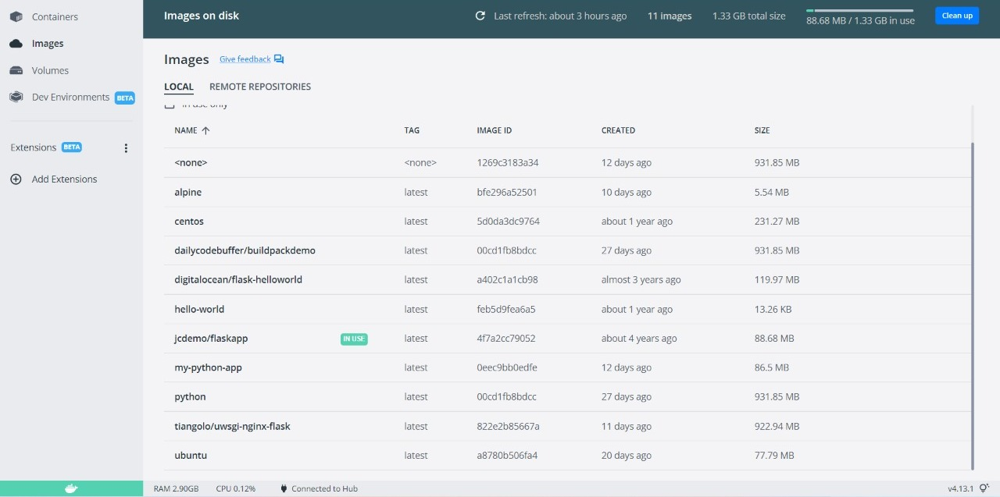
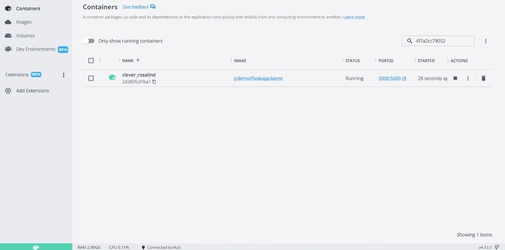
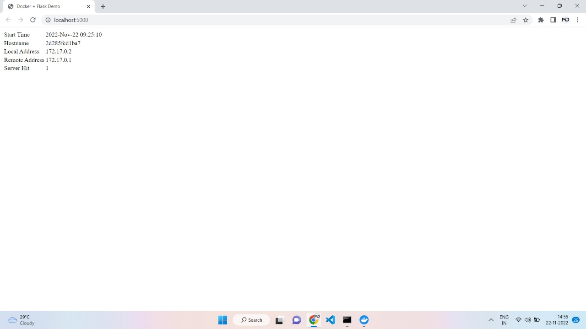

##### 1.Pull an Image from docker hub and run it in docker playground.

1. Pull Image from Docker Hub. Here (flaskdemo/demo) is the pulled Image.

2. Run Image in Container

3. Container App Output

